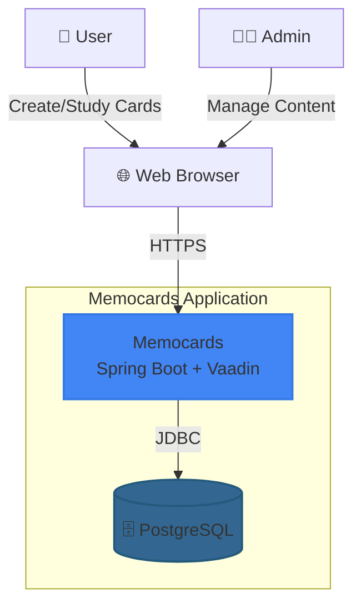
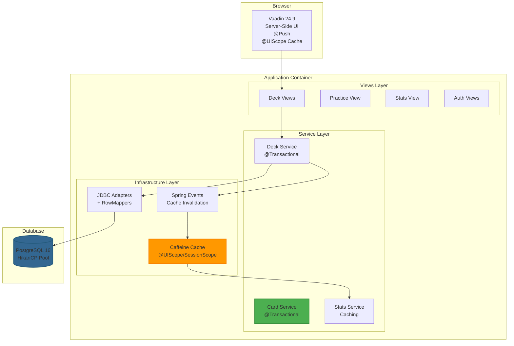
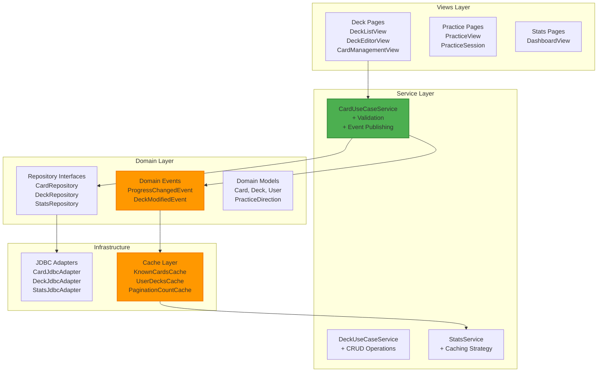
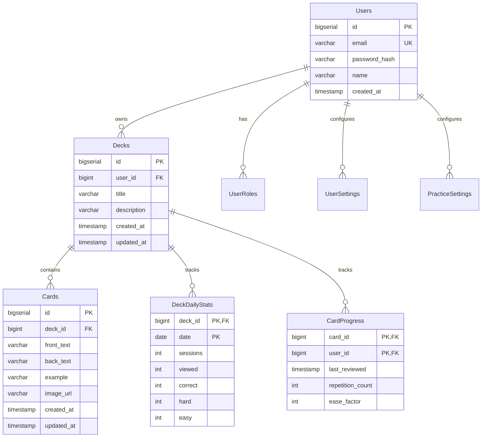
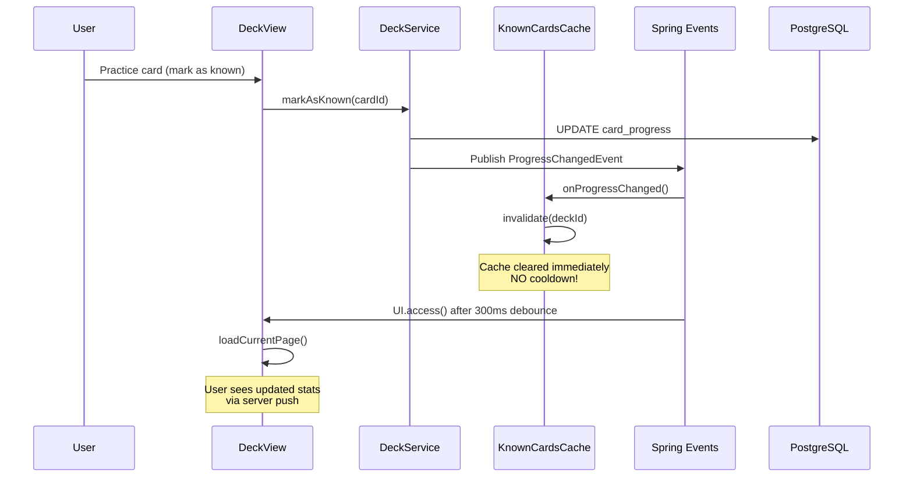
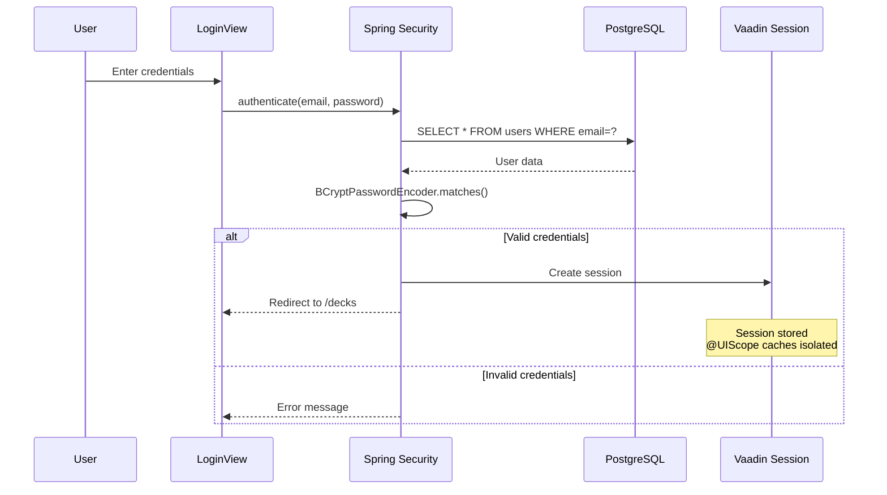
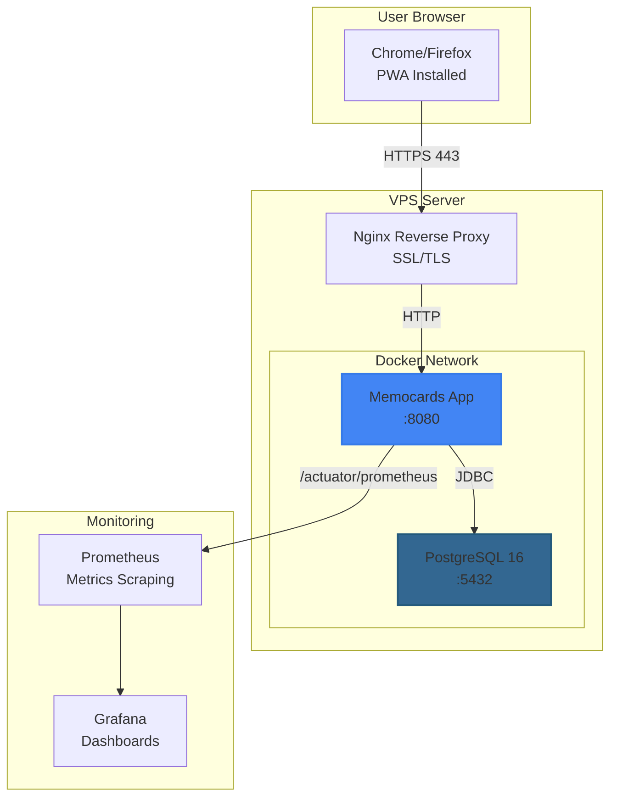

# Memocards - Architecture Documentation

## System Overview

Memocards is a flashcard learning application built with Clean Architecture principles, leveraging Spring Boot 3.5, Vaadin 24.9, and PostgreSQL 16.

---

## C4 Model Diagrams

### Level 1: System Context

**Actors:**
- **Users**: Create decks, study cards, track progress
- **Admins**: Manage news, moderate content
- **Web Browser**: PWA-capable, offline support

**External Systems:**
- **PostgreSQL 16**: Database (VPS or cloud)

---

### Level 2: Container Diagram

**Technologies:**
- **UI**: Vaadin 24.9 with server push
- **Business Logic**: Spring Boot services with @Transactional
- **Data Access**: Spring Data JDBC with explicit SQL control
- **Cache**: Caffeine + custom @UIScope/@SessionScope caches
- **Events**: Spring Events for decoupled cache invalidation

---

### Level 3: Component Diagram

**Key Components:**
- **UseCase Services**: Business logic, validation, transaction boundaries
- **JDBC Adapters**: Data access with explicit SQL control
- **Cache Layer**: Event-driven invalidation, multi-scope (UI/Session)

---

## Database Schema (ER Diagram)

**Key Relationships:**
- `Users` → `Decks` (1:N): User owns multiple decks
- `Decks` → `Cards` (1:N): Deck contains multiple cards
- `Users` + `Cards` → `CardProgress` (N:M): Tracks user progress per card

---

## Cache Invalidation Flow

**Key Principles:**
1. **Immediate Invalidation**: Event → Cache cleared (0ms)
2. **UI Debouncing**: 300ms delay before refresh (UX)
3. **Server Push**: `UI.access()` for real-time updates
4. **No Cooldown in Cache Layer**: Data consistency > performance

---

## Authentication Flow

**Security Features:**
- BCrypt password hashing
- Spring Security session management
- MDC logging with userId
- Audit trail for auth events

---

## Deployment Architecture

**Deployment Stack:**
- **Reverse Proxy**: Nginx (SSL termination)
- **Application**: Docker container (Jib multi-arch image)
- **Database**: PostgreSQL 16 with SCRAM-SHA-256
- **Monitoring**: Prometheus + Grafana

---

## Technology Stack Summary

| Layer | Technology | Purpose |
|-------|-----------|---------|
| **UI** | Vaadin 24.9 | Server-side rendering, PWA |
| **Business Logic** | Spring Boot 3.5 | Dependency injection, transactions |
| **Data Access** | Spring Data JDBC | Explicit SQL control |
| **Database** | PostgreSQL 16 | Relational database |
| **Cache** | Caffeine + Custom | Multi-layer caching |
| **Events** | Spring Events | Decoupled invalidation |
| **Security** | Spring Security | Authentication, authorization |
| **Monitoring** | Actuator + Prometheus | Metrics, health checks |
| **Deployment** | Docker + Ansible | Automated deployment |
| **CI/CD** | GitHub Actions | Automated testing, building |

---

## Architecture Principles

### 1. Clean Architecture
- **Dependency Rule**: Dependencies point inward
- **Layer Independence**: Domain has no external dependencies
- **Testability**: Each layer tested independently

### 2. SOLID Principles
- **Single Responsibility**: One class, one reason to change
- **Dependency Inversion**: Depend on abstractions (Repository interfaces)
- **Open/Closed**: Extensible via interfaces

### 3. Performance
- **Event-Driven Caching**: Immediate invalidation, no polling
- **Connection Pooling**: HikariCP with optimal settings
- **N+1 Prevention**: Batch operations for multiple items
- **Virtual Threads**: Java 21 concurrent processing

### 4. Security
- **Parameterized Queries**: SQL injection prevention
- **HSTS Headers**: HTTPS enforcement
- **BCrypt Hashing**: Secure password storage
- **OWASP Compliance**: Automated scanning

---

## Files

- `docs/architecture.md` - This document
- `grafana/dashboard-memocards.json` - Monitoring dashboard
- `README.md` - Project overview
- `CONTRIBUTING.md` - Contributor guide
