# Memocards - Architecture Documentation

## System Overview

Memocards is a flashcard learning application built with Clean Architecture principles, leveraging Spring Boot 3.5, Vaadin 24.9, and PostgreSQL 16.

Note: Diagrams are Mermaid blocks maintained in this file. Update inline and review via IDE preview or MR diffs (include date of change in commit message).

---

## C4 Model Diagrams

### Level 1: System Context

```mermaid
graph TB
    User[👤 User] 
    Admin[👨‍💼 Admin]
    Browser[🌐 Web Browser]
    
    subgraph "Memocards Application"
        App[Memocards<br/>Spring Boot + Vaadin]
        DB[(🗄️ PostgreSQL)]
    end
    
    User -->|Create/Study Cards| Browser
    Admin -->|Manage Content| Browser
    Browser -->|HTTPS| App
    App -->|JDBC| DB
    
    style App fill:#4285f4,stroke:#357ae8,stroke-width:2px
    style DB fill:#336791,stroke:#245a7c,stroke-width:2px
```



**Actors:**
- **Users**: Create decks, study cards, track progress
- **Admins**: Manage news, moderate content
- **Web Browser**: PWA-capable, offline support

**External Systems:**
- **PostgreSQL 16**: Database (VPS or cloud)

---

### Level 2: Container Diagram


**Technologies:**
- **Edge Proxy**: Nginx (SSL termination, security headers)
- **Internal Router**: Traefik v3.0 (dynamic service discovery)
- **UI**: Vaadin 24.9 with server push
- **Business Logic**: Spring Boot services with @Transactional
- **Data Access**: Spring Data JDBC with explicit SQL control
- **Cache**: Caffeine + custom @UIScope/@SessionScope caches
- **Events**: Spring Events for decoupled cache invalidation
- **Monitoring**: Prometheus, Grafana, Loki, Promtail

---

### Level 3: Component Diagram


**Key Components:**
- **UseCase Services**: Business logic, validation, transaction boundaries
- **JDBC Adapters**: Data access with explicit SQL control
- **Cache Layer**: Event-driven invalidation, multi-scope (UI/Session)
- **Infrastructure**: Nginx (edge) + Traefik (internal routing)

---

## Database Schema (ER Diagram)


**Key Relationships:**
- `Users` → `Decks` (1:N): User owns multiple decks
- `Decks` → `Cards` (1:N): Deck contains multiple cards
- `Users` + `Cards` → `CardProgress` (N:M): Tracks user progress per card

---

## Infrastructure

This project uses a hybrid edge + dynamic routing setup. See Deployment Architecture below for the single authoritative infrastructure diagram. Routing specifics are documented in the Routing Rules table.

## Cache Invalidation Flow


**Key Principles:**
1. **Immediate Invalidation**: Event → Cache cleared (0ms)
2. **UI Debouncing**: 300ms delay before refresh (UX)
3. **Server Push**: `UI.access()` for real-time updates
4. **No Cooldown in Cache Layer**: Data consistency > performance

---

## Authentication Flow


**Security Features:**
- BCrypt password hashing
- Spring Security session management
- MDC logging with userId
- Audit trail for auth events

---

## Deployment Architecture

### Hybrid Architecture (Production)


**Deployment Stack (Hybrid Architecture):**
- **Edge Proxy**: Nginx (SSL termination, security headers, rate limiting)
- **Internal Router**: Traefik v3.0 (dynamic routing via Docker labels)
- **Application**: Docker container (Jib multi-arch image)
- **Database**: PostgreSQL 16 with SCRAM-SHA-256
- **Monitoring**: Prometheus + Grafana + Loki + Promtail

**Architecture Benefits:**
- ✅ Nginx: Stable SSL termination, security, edge proxy
- ✅ Traefik: Dynamic service discovery, automatic routing
- ✅ No Nginx reloads: Adding services only requires Traefik labels
- ✅ Best of both worlds: Stability + Automation

---

## Internal Routing Architecture

### Traefik Routing Rules

| Service | Rule | Priority | Middleware |
|---------|------|----------|------------|
| **App** | `Host(memocards.duckdns.org) && !PathPrefix(/grafana\|/prometheus\|/traefik)` | 1 | None (fallback) |
| **Grafana** | `PathPrefix(/grafana)` | 10 | `stripPrefix(/grafana)` |
| **Prometheus** | `PathPrefix(/prometheus)` | 10 | None |
| **Traefik Dashboard** | `PathPrefix(/traefik) \|\| PathPrefix(/api)` | 10 | None |

### Service Discovery

All services use **Docker labels** for automatic Traefik discovery:

```yaml
labels:
  - "traefik.enable=true"
  - "traefik.http.routers.service-name.rule=PathPrefix(`/service`)"
  - "traefik.http.routers.service-name.entrypoints=web"
  - "traefik.http.services.service-name.loadbalancer.server.port=8080"
```

**Advantages:**
- ✅ No manual Nginx configuration
- ✅ Dynamic routing without reloads
- ✅ Easy to add new services
- ✅ Automatic health checks

---

## Technology Stack Summary

| Layer | Technology | Purpose |
|-------|-----------|---------|
| **UI** | Vaadin 24.9 | Server-side rendering, PWA |
| **Business Logic** | Spring Boot 3.5 | Dependency injection, transactions |
| **Data Access** | Spring Data JDBC | Explicit SQL control |
| **Database** | PostgreSQL 16 | Relational database |
| **Cache** | Caffeine + Custom | Multi-layer caching |
| **Events** | Spring Events | Decoupled invalidation |
| **Security** | Spring Security | Authentication, authorization |
| **Monitoring** | Actuator + Prometheus + Grafana + Loki | Metrics, logs, dashboards |
| **Reverse Proxy** | Nginx + Traefik (Hybrid) | SSL termination + internal routing |
| **Deployment** | Docker + Ansible | Automated deployment |
| **CI/CD** | GitHub Actions | Automated testing, building |

---

## Architecture Principles

### 1. Clean Architecture
- **Dependency Rule**: Dependencies point inward
- **Layer Independence**: Domain has no external dependencies
- **Testability**: Each layer tested independently

### 2. SOLID Principles
- **Single Responsibility**: One class, one reason to change
- **Dependency Inversion**: Depend on abstractions (Repository interfaces)
- **Open/Closed**: Extensible via interfaces

### 3. Performance
- **Event-Driven Caching**: Immediate invalidation, no polling
- **Connection Pooling**: HikariCP with optimal settings
- **N+1 Prevention**: Batch operations for multiple items
- **Virtual Threads**: Java 21 concurrent processing

### 4. Security
- **Parameterized Queries**: SQL injection prevention
- **HSTS Headers**: HTTPS enforcement
- **BCrypt Hashing**: Secure password storage
- **OWASP Compliance**: Automated scanning

---

## Files

### Documentation Index

- Architecture Overview (this file)
- SLO/SLI/SLA: [slo.md](./slo.md)
- Non-functional Requirements: [non-functional-requirements.md](./non-functional-requirements.md)
- Observability: [observability.md](./observability.md)
- Security & Privacy: [security.md](./security.md)
- Data Lifecycle: [data-lifecycle.md](./data-lifecycle.md)
- API Contracts: [api-contracts.md](./api-contracts.md)
- Release & Environments: [release-and-environments.md](./release-and-environments.md)
- CI/CD: [ci-cd.md](./ci-cd.md)
- Testing Strategy: [testing-strategy.md](./testing-strategy.md)
- Operations Runbooks: [operations-runbooks.md](./operations-runbooks.md)
- UX/i18n/a11y: [ux-i18n-a11y.md](./ux-i18n-a11y.md)
- ADRs: [adr/](./adr/)
- Glossary: [glossary.md](./glossary.md)
- Ownership: [ownership.md](./ownership.md)
- Config Matrix: [config-matrix.md](./config-matrix.md)

Other:
- Grafana dashboard JSON: [dashboard-memocards.json](../grafana/dashboard-memocards.json)
- Project overview: [README.md](../README.md)
- Contributor guide: [CONTRIBUTING.md](../CONTRIBUTING.md)

